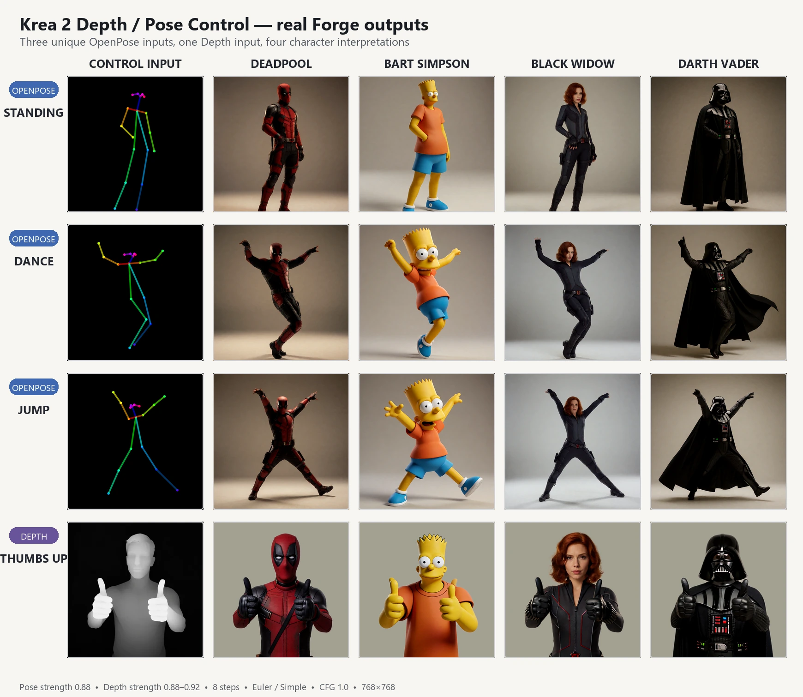

# Krea-2 Depth + Pose ControlNet-LoRA — Forge Classic 2.28.1 fork

## Forge Classic 2.28.1 compatibility

### Why this fork?

The original Krea 2 depth-control project is a standalone inference and
training toolkit, not a Stable Diffusion WebUI extension. Cloning it into
`extensions` therefore did not add a Forge panel or connect it to Forge's model
lifecycle, low-VRAM loading, Hires fix, Krea Edit references, or normal
generation flow.

I found the depth-control tool too useful to leave outside WebUI, so I turned it
into a native integration for **sd-webui-forge-classic 2.28.1**, then added an
independent Pose/OpenPose path based on the Krea 2 edit/reference architecture.
Both paths are tested through Forge's real generation lifecycle.

This fork adds a native, always-visible Forge panel while keeping the original
standalone scripts and training code available. It has been tested on Windows,
Python 3.13, Gradio 4.40 and a Krea 2 checkpoint using the Qwen/Krea image VAE.

### What changed compared with the original project

| Original standalone project | This Forge Classic fork |
| --- | --- |
| Command-line Depth inference and training utilities | Native txt2img/img2img always-on panel using Forge's generation lifecycle |
| One Depth input per standalone run | An ordered file list with add, remove, reorder and click-to-edit; files alternate `A, B, C, A…` across batches and iterations |
| Photo-to-depth or supplied Depth map | The same two Depth paths, with independent mode, preprocessor, resolution, inversion and strength for every file |
| No Pose path | Photo-to-DWPose and supplied OpenPose-map paths, available in the same per-file list and usable sequentially with Depth |
| No input-type assistance | Conservative colour/statistics detection of photo, Depth map and coloured OpenPose map; reliable detections select the direct-map path automatically and manual settings always win |
| Input sizing owned by the standalone pipeline | Exact Forge and Hires dimensions with centered black letterboxing, no crop or stretch, plus a non-blocking ratio warning |
| Fixed trained control contribution | `0–2` Depth/Pose strength slider; `0` is a true no-op |
| No Forge preview/cache | Selected source and final-resolution preview, cache-all action, generation-local preprocessing cache, plus the active reference(s) in Forge's live preview while files and batches are prepared |
| Models handled by the standalone setup | Revision-pinned, size- and SHA-256-verified Depth, Pose and DWPose downloads with safe cache reuse |
| Standard PyTorch inference | Generation-local Forge patches compatible with low-VRAM loading and on-the-fly GGUF LoRA application |

The lower half of this README keeps the original standalone documentation for
training and command-line inference. The Forge-specific sections above are the
extension layer added by this fork.

## Install in Forge Classic 2.28.1

Clone this fork into Forge's `extensions` directory, then restart Forge:

```bash
git clone -b forge-classic-2.28.1 \
  https://github.com/fabiencomte/Krea-2-controlnet.git
```

Open **Krea 2 Depth / Pose ControlNet-LoRA** below txt2img or img2img, add one or
more images, adjust the selected row if needed, and click **Download / verify
models needed by the list**. Enable the accordion before Generate. All
downloaded weights live outside Git.

### Depth mode

Keep `depth_anything_v2` selected to turn photos into depth maps, or choose
**None (already a depth map)**. White means near by default; use **Invert depth
map** for the opposite convention. The 862 MB adapter is stored at:

```text
models/ControlNet/Krea2/depth-control-lora.safetensors
```

Depth Anything V2 downloads its own model through Forge on first use.

### Pose / OpenPose mode

Choose **DWPose (photo to pose)** to extract body, hand and face keypoints from
a photo, or **None (already an OpenPose map)** to provide the coloured skeleton
directly. The extension installs the small `easy-dwpose==1.0.2` wrapper on Forge
restart without downgrading Forge's shared dependencies. The button downloads
and verifies the Pose adapter plus both DWPose ONNX weights; missing DWPose
weights are also fetched automatically on first DWPose use:

```text
models/ControlNet/Krea2/krea2_turbo_openpose_controlnet.safetensors
models/ControlNet/DWPose/dw-ll_ucoco_384.onnx
models/ControlNet/DWPose/yolox_l.onnx
```

The Pose adapter is trained for **Krea 2 Turbo**. Other Krea 2 derivatives may
load when their tensor layout matches, but their visual quality is not claimed.
The selected Krea checkpoint must include the Krea/Qwen VAE and Qwen3-VL vision
weights. Depth and Pose cannot be stacked in one simultaneous denoising batch,
but they can alternate between sequential batches. Use **Batch size 1** when
files have different modes or strengths. A simultaneous batch is accepted only
when every active row in that batch has the same mode and strength; incompatible
lists fail early with an actionable message.

The pinned official Pose workflow enables `kv_cache`. The extension therefore
computes each clean OpenPose reference once at `t=0`, then appends only its
cached attention keys and values to live denoising. Source pixels are never
inserted as live queries, which prevents the coloured skeleton and its black
canvas from being copied into the generated image.

The source selector is an ordered list. Adding several files preserves their
selection order and selects the newest row. Click a row to show its source,
preview and private settings; **Move up**, **Move down**, **Remove selected** and
**Clear list** keep the active row predictable. New files inherit the currently
displayed settings before auto-detection is applied. The detector confidently
recognises smooth near-grayscale Depth maps and sparse coloured OpenPose
skeletons on black; ambiguous grayscale art, monochrome line drawings and
ordinary photos keep the current settings. The detected type, confidence and
reason remain visible, and manual choices always override the suggestion.

**Preview selected** prepares one final-resolution control. **Cache all
previews** prepares the whole list and reuses still-valid entries; changing a
file's mode, preprocessor, resolution or inversion invalidates only that file,
while changing strength keeps its visual preview. Changing Forge/Hires target
dimensions invalidates every preview because their letterboxing changes. When a
source aspect ratio differs, the complete control map is centered on the target
canvas and unused space is filled with black bars: no edge is cropped and
geometry is not stretched. The difference produces a non-blocking warning.

Generation alternates the entries in `A, B, C, A…` order across batch positions
and successive batches, including Pose visual-text conditioning. Scheduled
preprocessors, raw control maps, final previews and verified adapter states are
cached once at launch and reused across sampling and Hires passes. Duplicate
files with identical processing settings share the expensive result. The cache
is generation-local and is cleared after completion, interruption or error.
When Forge live previews are enabled, each control appears while it is prepared,
then the reference actually used by the current batch is shown; a simultaneous
multi-image batch uses a labelled mini-grid before Forge's normal denoising
preview takes over.

Each row's **Control strength** is its structure-versus-prompt control. `0` is a
true no-op, lower non-zero values give the prompt more freedom, and values above
`1` tighten control at a possible quality cost. Depth uses `1` as its trained
strength; Pose generally works best around `0.8–1.0`. Forge CFG stays separate.

DWPose is designed for people. Occlusion, cropped limbs, very small subjects or
non-human anatomy can produce incomplete keypoints; inspect the preview before
generating. A Pose reference also adds image tokens, so high-resolution Hires
jobs use more VRAM than plain Krea generation. Hires remains more compositionally
variable than a direct 512×512 Pose run and can invent duplicate anatomy; start
at 512×512, keep Hires denoising modest and inspect the result. This sampling
limit is distinct from source-map leakage, which the cached K/V path removes.

### List behaviour and edge cases

| Sequence | Result |
| --- | --- |
| Add one file | It becomes selected, inherits the visible editor settings, then confident auto-detection may choose a direct Depth/OpenPose input. |
| Add several files | Their chooser order is preserved and the newest row becomes selected. Every row gets a unique identity, including duplicate paths. |
| Click a row | Its source, settings and its own cached preview are shown; programmatic selection does not accidentally fire editor changes. |
| Change mode/input/resolution/inversion | Only that row changes and only its preview is invalidated. Changing strength preserves the preview because the control pixels do not change. |
| Move or remove first/middle/last | The edited file follows its row when moved; after removal the nearest surviving row is selected. Removed preview data is discarded. |
| Clear, then add again | The list/cache is empty but the visible editor values remain useful as defaults for the next files. |
| Fewer generated slots than list entries | Generation continues with the scheduled prefix and warns how many files are unused. |
| More generated slots than entries | References cycle continuously in `A, B, C, A…` order across both batch positions and iterations. |
| Same mode/strength, different preprocessors | A simultaneous batch is supported; each source is preprocessed with its own settings. |
| Different modes or strengths in one simultaneous batch | Generation fails closed and asks for `Batch size 1`; compatible consecutive batches may still alternate modes. |
| Missing/corrupt file, unavailable model or preprocessor error | The request fails closed instead of silently generating without control; temporary state is removed. |
| Skip/interruption while caching or sampling | Further preparation stops, Pose conditioning is restored and generation-local maps/model states are released. The next request starts cleanly. |
| Hires or target dimensions change | UI previews are cleared; generation reuses the expensive raw preprocessing but refits Depth to each real pass and keeps black bars centered. |

### Why this Forge integration is safe

- It clones Forge's current `UnetPatcher` for each sampling pass. The base model
  and Forge core files are not changed.
- It keeps Forge's real Krea input layer registered, so cold-load and low-VRAM
  moves remain under Forge's control. The depth checkpoint intentionally
  replaces that layer's output for the noisy image tokens, matching its official
  inference code; a separate LoRA aimed specifically at `first.weight` therefore
  does not combine with depth control on that one call.
- During each denoising call, a temporary one-shot hook applies the checkpoint's
  complete trained input projection (`first.weight` and `first.bias`) to the
  noisy image tokens only. Krea Edit reference tokens keep their normal path.
- All 224 expected LoRA pairs are shape-checked before sampling. A partial or
  incompatible checkpoint is rejected instead of being applied silently.
- Pose verifies all 256 rank-32 LoRA layers, encodes Qwen vision at no more than
  `384×384` total pixels, limits the VAE reference to 1 MP, and reproduces the
  trained `Picture 1` + `index_timestep_zero` + `kv_cache` contract. Each batch
  item is VAE-encoded independently and keeps its own visual embedding, clean
  reference latent and isolated t=0 attention K/V.
- GGUF checkpoints use Forge's required on-the-fly LoRA path, so deltas are
  applied to dequantised logical weights instead of compressed byte storage.
- A control error installs a fail-closed sampling guard. Forge cannot quietly
  continue with an uncontrolled image.
- Generate, Skip and Interrupt remain entirely owned by Forge. The temporary
  hook is always removed in `finally`, including after an interruption.
- The WebUI API accepts the same base64 image format as `/sdapi/v1/txt2img`.
  Its booleans, resolution and strength are validated strictly, so an ambiguous
  or out-of-range request fails closed instead of silently changing meaning.
- Every download is revision-pinned and SHA-256 verified. Depth uses
  `fb80547ed79b47c1e3fea7bb9d36297e3917b2115fab6700ca1501350f9f483c`, Pose uses
  `0ddc3aafce4abdf7af3309b2f00c1bacdf15df1f2b4fb7adc9ff71795da90ecf`, and the
  DWPose pose/detector weights use `724f4ff2439ed61afb86fb8a1951ec39c6220682803b4a8bd4f598cd913b1843`
  and `7860ae79de6c89a3c1eb72ae9a2756c0ccfbe04b7791bb5880afabd97855a411`.
  A valid local file is reused; a corrupt file is replaced.
- Depth preprocesses each source once, then refits the cached raw map to every
  sampling pass's real dimensions. Pose also preprocesses once and reuses the
  same uncropped, final-resolution letterboxed structure for both Hires passes.

### Verified cases

- 101 automated tests: official checkpoint layout, completeness and logical GGUF
  tensor shapes, on-the-fly GGUF patching, full projection weight/bias, CFG
  batch repetition, per-file list editing/reordering/removal, conservative
  Depth/OpenPose/photo detection, mixed-mode batch validation, generation and
  preview cache reuse, duplicate files, interruption cleanup, multi-image
  alternation, centered black letterboxing,
  non-square and changed-ratio Hires dimensions, preview/API contracts,
  previous-wrapper multi-call composition, one-shot Krea Edit behavior,
  low-VRAM dtype casts, strict controls, pinned local/download integrity, Pose
  per-image visual conditioning, isolated t=0 K/V caching and reset, independent
  Wan-VAE image batching, DWPose body/hand/face
  rendering, and cleanup after an interrupt-like exception;
- release-candidate end-to-end matrix in Forge/Gradio 4.40 with four ordered
  entries: photo→Depth Anything V2, photo→DWPose, supplied Depth map and
  supplied OpenPose map. `Cache all previews` produced four 128×128 previews,
  reported two non-blocking ratio warnings and preserved every source with
  centered black bars; sequential generation produced four saved 128×128
  images, while metadata recorded four control files and both adapter paths;
- per-file strength persistence was rechecked at `0.65`, including selection
  changes and inheritance by a newly added file; add, move up/down and remove
  all completed without losing the other entries' settings;
- the same mismatched-ratio photo completed a real Hires 128→256 generation;
  the saved result was 256×256 and the uncropped letterboxed control preview
  matched both passes;
- the model action re-verified the Depth adapter, Pose adapter and both DWPose
  ONNX files from the UI. A mixed simultaneous batch was then rejected with the
  `set Batch size to 1` instruction, a normal request recovered, a four-entry
  run exposed active reference `2` in Forge's live progress, interruption at
  75% returned control to the UI, and the following request completed cleanly;
- a real GGUF Krea 2 batch generation with two different control images at
  256×256, producing two saved images with the expected extension metadata;
- real two-file estimated batches for both photo→Depth Anything V2 and
  photo→DWPose, with references `1, 2` observed through Forge's live-preview
  channel and `Images: 2` recorded in generation metadata;
- real Pose GGUF generations on an RTX 4060 Ti 16 GB: single image, two distinct
  references in one batch, and Hires 128→256 using a mismatched-ratio map;
- real Gradio 4.40 list interaction: multi-file chooser, row selection, inherited
  settings, per-file mode changes, add/reorder/remove, cache status
  synchronisation, full uncropped previews, black bars and a non-blocking ratio
  warning;
- real colour detection on a generated DWPose map (**OpenPose 93%**) and a
  Depth map (**Depth 95%**), with both direct-map preprocessors selected
  automatically and a normal photo left on its estimator path;
- a real mixed sequential list (`Batch size 1`, `Batch count 2`) containing a
  supplied OpenPose map followed by a supplied Depth map; both images completed,
  active references `1` and `2` and both adapter paths appeared in infotext;
- a real incompatible simultaneous mixed batch failed closed with the visible
  `set Batch size to 1` instruction, followed by a successful controlled request
  proving cleanup/recovery;
- deterministic strength comparisons with the same prompt and seed for both
  paths; Pose `0.85` versus `0.25` produced a 104.27 mean absolute pixel change;
- Skip during batch 1/2, continuation and successful batch 2/2;
- Interrupt during sampling followed by a clean controlled generation;
- regression campaign with the supplied `dance_05.png`, `jumping_05.png`
  and `standing_13.png`: all three skeletons were detected as OpenPose at
  93%; the old live-token path visibly copied coloured limbs and black blocks,
  while the cached K/V path kept spatial source-colour matches below 0.71% and
  black-background copies below 0.86% on every output;
- the corrected two-image batches preserved `dance+jump` and `jump+dance`
  attribution instead of broadcasting the first reference: every batch output
  was pixel-identical to its matching single-reference run and stayed
  21.78-27.56 MAE away from the wrong reference;
- Depth runtime matrix over the supplied thumbs-up map plus the squirrel and
  dragon-relief maps: 15/15 controlled-versus-disabled comparisons passed over
  seeds 101, 102, 303, 404 and the pre-registered holdout 707. Dense-map
  correlation was 0.662-0.888 with gains of 0.389-0.686 over disabled; the
  sparse squirrel used additional original-versus-mirror discrimination, and
  every output passed literal-copy and metadata gates;
- Ruff, `compileall`, `git diff --check`, UI load and API infotext metadata.

### Visual examples

The matrix below uses each of the three supplied OpenPose maps exactly once
(`standing_13.png`, `dance_05.png` and `jumping_05.png`), plus the supplied
thumbs-up Depth map once. Every character subject is a real Forge output from
the extension. Pose panels are unretouched apart from resizing; for a coherent
comparison, the four Depth presentation backgrounds are normalized by the
documented deterministic montage script while the raw API PNGs stay unchanged.



The selected outputs passed the pre-registered anti-copy and metadata gates.
Black Widow uses her black tactical suit. The four Depth portraits deliberately
share the same neutral studio background, seed family and framing.

The complete reproduction kit — exact prompts, negative prompts, seeds, grouped
batch selections, source controls, model hashes, generator, validator and composer —
is available in [examples/character-matrix](examples/character-matrix/README.md).

Run the tests from this repository:

```bash
python -m pytest -q tests
python -m ruff check forge_krea2_depth scripts tests install.py
python -m compileall -q forge_krea2_depth scripts tests install.py
```

### API example

Use the always-on script name `Krea 2 Depth / Pose ControlNet-LoRA` and these
seven arguments: enabled, mode, one image or a list, preprocessor, resolution,
invert-depth, strength.

```json
{
  "alwayson_scripts": {
    "Krea 2 Depth / Pose ControlNet-LoRA": {
      "args": [
        true,
        "Pose / OpenPose",
        [
          "data:image/png;base64,...",
          "data:image/png;base64,..."
        ],
        "DWPose (photo to pose)",
        768,
        false,
        0.85
      ]
    }
  }
}
```

For API calls, keep both checkbox values as JSON booleans, the resolution as an
integer from 256 to 2048, and strength as a finite number from 0 to 2. Valid
mode strings are `Depth` and `Pose / OpenPose`.

The upstream depth repository currently contains no code license file. This fork
does not invent or change one. The Pose reference algorithm is adapted from the
MIT-licensed [Ostris Krea 2 edit implementation](https://github.com/ostris/ComfyUI-Krea2-Ostris-Edit),
and DWPose is Apache-2.0. Model weights remain subject to their source terms and
the [Krea 2 community license](https://www.krea.ai/krea-2-licensing). The Pose
adapter comes from [thedeoxen/Krea-2-pose-controlnet](https://huggingface.co/thedeoxen/Krea-2-pose-controlnet);
the DWPose weights come from [RedHash/DWPose](https://huggingface.co/RedHash/DWPose).

---

## Original standalone project

Depth-conditioned generation for [Krea-2](https://github.com/krea-ai/krea-2). Give it any image and a prompt — it extracts the depth map with Depth-Anything-V2 and generates a new image with the **same 3D structure** and composition, but whatever content and style you ask for.

- Trained on **Krea-2-Raw**, works on both **Raw** and **Krea-2-Turbo** (8-step)
- Single 862MB LoRA file (rank 64 + expanded input projection), base stays frozen
- Depth consistency (Pearson corr. of input depth vs. depth of generated image): **0.98** with no prompt, **0.99** with prompts

*Each strip: init image → extracted depth → generated output.*

## Examples


## Checkpoint

| file | base trained on | size |
|---|---|---|
| [`depth-control-lora.safetensors`](https://huggingface.co/Patil/Krea-2-depth-controlnet/blob/main/depth-control-lora.safetensors) | krea/Krea-2-Raw | 862MB |

## Setup

```bash
git clone https://github.com/Tanmaypatil123/Krea-2-controlnet.git
cd Krea-2-controlnet
pip install -r requirements.txt

hf download Patil/Krea-2-depth-controlnet depth-control-lora.safetensors --local-dir .
```
## Inference

```bash
# Turbo base — fast, recommended (8 steps, no CFG)
python inference.py photo.jpg -p "a futuristic spaceship interior, cinematic lighting" \
    --lora depth-control-lora.safetensors

# Raw base — undistilled (28-52 steps, CFG 3.5)
python inference.py photo.jpg -p "..." --lora depth-control-lora.safetensors \
    --base raw

# No prompt: the depth map is the only signal
python inference.py photo.jpg --lora depth-control-lora.safetensors --save-strip

# Weaker structure adherence (more creative freedom)
python inference.py photo.jpg -p "..." --lora depth-control-lora.safetensors --lora-scale 0.6
```

| flag | default | notes |
|---|---|---|
| `-p / --prompt` | `""` | empty = depth-only generation |
| `--base` | `turbo` | `turbo` or `raw` |
| `--steps` | 8 turbo / 28 raw | |
| `--cfg` | 0 turbo / 3.5 raw | classifier-free guidance |
| `--mu` | 1.15 turbo / auto raw | timestep shift |
| `--lora-scale` | 1.0 | control-strength dial |
| `--seed` | 0 | |
| `--save-strip` | off | also saves input\|depth\|output comparison |

### Python API

```python
from PIL import Image
from huggingface_hub import hf_hub_download
from pipeline import DepthLoRAPipeline

base = hf_hub_download("krea/Krea-2-Turbo", "turbo.safetensors")
pipe = DepthLoRAPipeline(base, "depth-control-lora.safetensors")

out, depth = pipe(Image.open("photo.jpg"),
                  prompt="a cozy cabin interior at dusk",
                  steps=8, cfg=0.0, mu=1.15, seed=0)
out.save("output.png")
```

## How it works (inference path)

1. The init image is resized to the nearest ~1MP aspect bucket and run through **Depth-Anything-V2-Large** → inverse depth map (near = white).
2. The depth map is encoded with the same **Qwen-Image VAE** the model uses for images, so control lives in latent space.
3. At every denoising step, the depth latent is **concatenated channel-wise** to the noisy latent (each DiT token: 64 → 128 dims). The expanded input projection + rank-64 LoRA on all 28 blocks (both included in the checkpoint) steer generation to follow the depth structure.
4. Standard Krea-2 flow-matching Euler sampling otherwise — same recipe as BFL's Flux.1-Depth-dev-lora.

## Tips & limitations

- **Best inputs**: photos / renders with real perspective. Flat 2D illustrations produce nearly-uniform depth maps, so control will be weak (garbage in, garbage out).
- Empty-prompt generation works (0.98 depth consistency) — useful for testing how much structure the control alone carries.
- `--lora-scale` below 1.0 relaxes structure adherence; above 1.0 tightens it at some quality cost.
- Krea-2-Raw generates up to ~1K resolution; outputs are capped at the ~1MP buckets.

## Training your own ControlNet-LoRA

The training code is in [`trainer/`](trainer/) and is **control-type agnostic**: the same recipe trains depth, canny, tile, gray, or any custom pixel-aligned control signal. See [trainer/README.md](trainer/README.md) for data preparation (local folder or HF dataset), the shard format, and training instructions.

```bash
# example: canny ControlNet-LoRA from a folder of captioned images
python trainer/prepare_data.py --source folder --input-dir ./my_images \
    --out-dir ./data --control-type canny
python trainer/train_control_lora.py --data-dir ./data --ckpt-dir ./ckpts \
    --raw-ckpt raw.safetensors --control-type canny
```

## Files

- `inference.py` — CLI
- `pipeline.py` — full pipeline: LoRA surgery, Qwen3-VL conditioner, VAE, depth estimator, flow sampler with control injection
- `mmdit.py` — unmodified DiT definition from the [krea-2 repo](https://github.com/krea-ai/krea-2)
- `k2_lora.py` — model surgery: expanded input projection + LoRA injection (used by the trainer)
- `trainer/` — data prep + training for any control type ([docs](trainer/README.md))

Model weights are subject to the [Krea 2 community license](https://www.krea.ai/krea-2-licensing).
